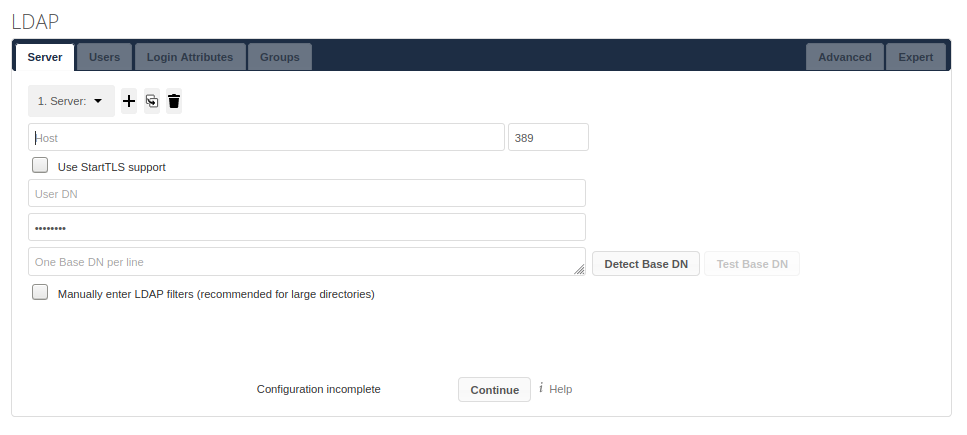

# Table of Contents
  - [As an administrator, how do I install and configure an ownCloud server?](#as-an-administrator-how-do-i-install-and-configure-an-owncloud-server)
     - [Prerequisites and Preparation](#prerequisites-and-preparation)
     - [Configuration: Apache and Database](#configuration-apache-and-database)
     - [Download and Installation](#download-and-installation)
  - [As an administrator, how do I add a user account?](#as-an-administrator-how-do-i-add-a-user-account)
  - [As a user, how do I connect to the ownCloud server using a desktop or mobile client?](#as-a-user-how-do-i-connect-to-the-owncloud-server-using-a-desktop-or-mobile-client)
  - [As an administrator, how do I enable users to connect to the ownCloud server using the server's IP address and port 8080?](#as-an-administrator-how-do-i-enable-users-to-connect-to-the-owncloud-server-using-the-servers-ip-address-and-port-8080)
     
# As an administrator, how do I install and configure an ownCloud server?
You can install ownCloud manually with [Docker Image](https://doc.owncloud.org/server/admin_manual/installation/docker/), or with an appliance. The following procedure demonstrates how to manually install ownCloud on a fresh installation of Ubuntu 18.04. For more information see, [ownCloud Download Server Packages](https://owncloud.com/download-server/).


## Prerequisites and preparation

- Ensure the prerequisites are met and the required or recommended packages are installed before installing ownCloud. For more information, see [Prerequisites and Preparation](https://doc.owncloud.com/server/10.8/admin_manual/installation/quick_guides/ubuntu_18_04.html).

## Configuration: Apache and database
 
 - Run these [commands](https://doc.owncloud.com/server/10.8/admin_manual/installation/quick_guides/ubuntu_18_04.html#configure-apache) in your **Terminal** to configure Apache and your database.
  
## Download and installation
Depending on your organization's needs — number of users, storage size, and high availability level — you can choose the right edition for your organization For more information, see [ownCloud Editions](https://owncloud.com/find-the-right-edition/).

  1. Download the ownCloud by using the command:
  ```markdown 
	cd /var/www/
	wget https://download.owncloud.org/community/owncloud-10.8.0.tar.bz2 && \
	tar -xjf owncloud-10.8.0.tar.bz2 && \
	chown -R www-data.owncloud
  ```
   2. Install the ownCloud by using the command:
   ```markdown 
     cc maintenance:install \
    --database "mysql" \
    --database-name "owncloud" \
    --database-user "owncloud" \
    --database-pass "password" \
    --admin-user "admin" \
    --admin-pass "admin"
  ```
  3. Configure ownCloud’s trusted domains by using the command:
  ```markdown
	myip=$(hostname -I|cut -f1 -d ' ')
	occ config:system:set trusted_domains 1 --value="$myip"
  ```
  4. Set your background job mode to [Cron](https://doc.owncloud.com/server/10.8/admin_manual/configuration/server/background_jobs_configuration.html) by using the following command.
 ```markdown
	occ background:cron
	echo "*/15  *  *  *  * /var/www/owncloud/occ system:cron" \
 	 > /var/spool/cron/crontabs/www-data
	chown www-data.crontab /var/spool/cron/crontabs/www-data
	chmod 0600 /var/spool/cron/crontabs/www-data
 ```
 5. Configure Caching and File Locking by using the command:
 ```markdown
	occ config:system:set \
	   memcache.local \
	   --value '\OC\Memcache\APCu'
	occ config:system:set \
	   memcache.locking \
 	  --value '\OC\Memcache\Redis'
	occ config:system:set \
 	  redis \
	   --value '{"host": "127.0.0.1", "port": "6379"}' \
  	 --type json
```
 6. Configure [Log Rotation](https://linux.die.net/man/8/logrotate) by using the command:
 ```markdown
	FILE="/etc/logrotate.d/owncloud"
	sudo /bin/cat <<EOM >$FILE
	/var/www/owncloud/data/owncloud.log {
	  size 10M
	  rotate 12
	  copytruncate
 	 missingok
 	 compress
 	 compresscmd /bin/gzip
	}
	EOM
```
 7. Complete the installation by using the command:
 ```markdown
	cd /var/www/
	chown -R www-data. owncloud
```
**Your ownCloud is now installed.** 
To verify if it's ready to use, navigate to [YourCloud Domain](http://your-owncloud-domain). 
For more information, refer [Detailed ownCloud Administration Guide](https://doc.owncloud.com/server/10.8/admin_manual/ownCloud_Admin_Manual.pdf).

# As an administrator, how do I add a user account? 
The ownCloud’s default view displays basic information about all the users. To add a new user, 
1. Enter username and e-mail of the new user.
   
2. Optional: Add group membership to the user. 
3. Click the **Create** button.
   The newly added user is now added to the list of users in the default view.
  
# As a user, how do I connect to the ownCloud server by using a desktop or mobile client?
You can connect Linux, Mac OS X, Windows, and mobile devices to your ownCloud server via [WebDAV](https://en.wikipedia.org/wiki/WebDAV). Use the [ownCloud Desktop](https://owncloud.com/desktop-app/) Client to keep your desktop PC synchronized with your ownCloud server. To sync your ownCloud server with Android and Apple iOS devices, use the [ownCloud Mobile apps](https://owncloud.com/mobile-apps/). 

# As an administrator, how do I enable users to connect to the ownCloud server using the server IP address and port 8080?
1. Install the [LDAP Integration](https://marketplace.owncloud.com/apps/user_ldap) application. 
2. Go to the Admin panel to configure LDAP. 
3. Import the Windows Server CA certificate in the **pem format** with **.crt suffix** to 
```markdown
    /usr/local/share/ca-certificates/
```
4. Run the following command.
 ```markdown 
   update-ca-certificates
   ```
5. In the **Server** tab of LDAP, enter the following details:
   
- **Host**: The hostname or IP address of the LDAP server. 
- **Port**: Enter the port number 8080.
- **User DN**: The name as domain name of a user who has permissions to search in the LDAP directory. 
- **Password**: The password of the mentioned user. 
- **Base DN**: The base domain name of LDAP, from where all users and groups can be reached. 
