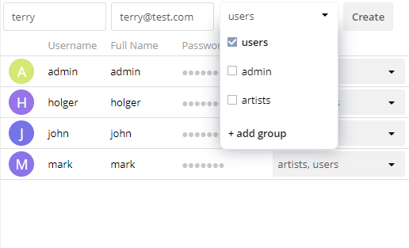
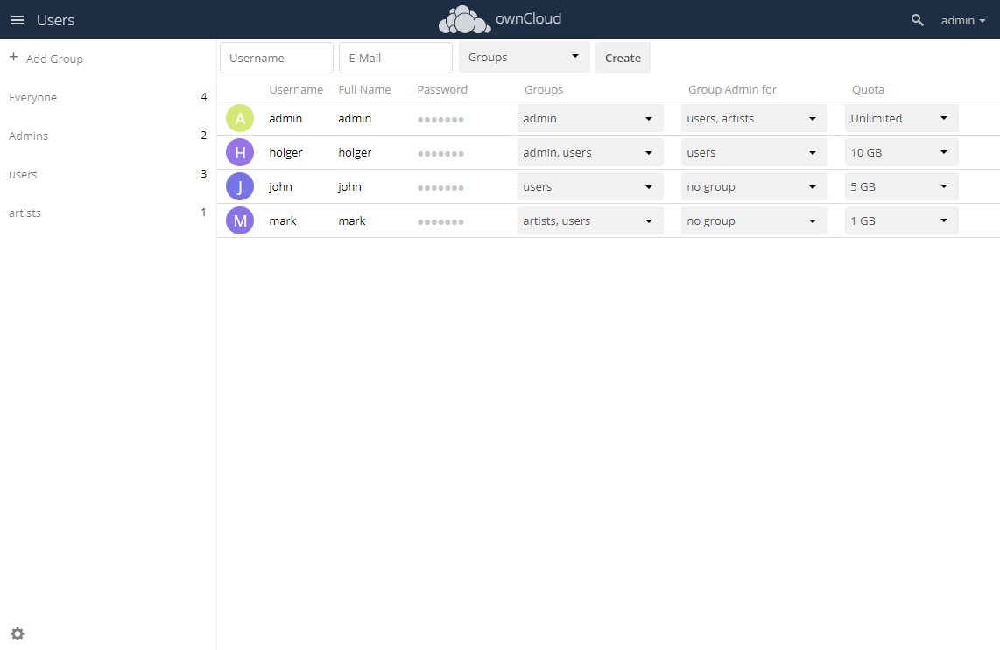

# Table of Contents
  - [As an administrator, how do I install and configure an ownCloud server?](#as-an-administrator-how-do-i-install-and-configure-an-owncloud-server)
  - [As an administrator, how do I add a user account?](#as-an-administrator-how-do-i-add-a-user-account)
  - [As a user, how do I connect to the ownCloud server using a desktop or mobile client?](#as-a-user-how-do-i-connect-to-the-owncloud-server-using-a-desktop-or-mobile-client)
  - [As an administrator, how do I enable users to connect to the ownCloud server using the server's IP address and port 8080?](#as-an-administrator-how-do-i-enable-users-to-connect-to-the-owncloud-server-using-the-servers-ip-address-and-port-8080)
     
# As an administrator, how do I install and configure an ownCloud server?

You can install ownCloud [Manually](https://doc.owncloud.com/server/admin_manual/installation/manual_installation/), with [Docker Image](https://doc.owncloud.org/server/admin_manual/installation/docker/), or with an [Appliance](https://doc.owncloud.com/server/admin_manual/appliance/installation/installation.html). Given below is an example to manually install ownCloud on fresh installation of Ubuntu 18.04. For more information see, [ownCloud Download Server Packages](https://owncloud.com/download-server/).

To install and configure ownCloud server, follow the steps below. 
## Prerequisites and Preparation

- Ensure the prerequisites are met and the required/recommended packages are installed before installing ownCloud. For more information, see [Prerequisites and Preparation](https://doc.owncloud.com/server/10.8/admin_manual/installation/quick_guides/ubuntu_18_04.html).

## Configuration: Apache and Database
1. Run the following commands in your **Terminal** to configure Apache.

- Change the Document Root 
```markdown
sed -i "s#html#owncloud#" /etc/apache2/sites-available/000-default.conf
service apache2 restart
```
- Create a Virtual Host Configuration
```markdown 
 FILE="/etc/apache2/sites-available/owncloud.conf"
/bin/cat <<EOM >$FILE
Alias /owncloud "/var/www/owncloud/"<Directory /var/www/owncloud/>
  Options +FollowSymlinks
  AllowOverride All<IfModule mod_dav.c>
  Dav off
 </IfModule>

 SetEnv HOME /var/www/owncloud
 SetEnv HTTP_HOME /var/www/owncloud
</Directory>
EOM
```
- Enable the Virtual Host Configuration
```markdown 
a2ensite owncloud.conf
service apache2 reload
```

2. Run the following commands in your **Terminal** to configure the database.
- Configure the Database
```markdown 
mysql -u root -e "CREATE DATABASE IF NOT EXISTS owncloud; \
GRANT ALL PRIVILEGES ON owncloud.* \
  TO owncloud@localhost \
  IDENTIFIED BY 'password'";
```
- Enable the Recommended Apache Modules
```markdown 
echo "Enabling Apache Modules"
a2enmod dir env headers mime rewrite setenvif
service apache2 reload
```
## Download and Installation
Depending on your organisation's needs - number of users, storage size, and high availability level - you can choose the right edition for your organisation. For more information, see [ownCloud Editions](https://owncloud.com/find-the-right-edition/).
1. Download the ownCloud using the command:
```markdown 
cd /var/www/
wget https://download.owncloud.org/community/owncloud-10.8.0.tar.bz2 && \
tar -xjf owncloud-10.8.0.tar.bz2 && \
chown -R www-data.owncloud
```
2. Install the ownCloud using the command:
```markdown 
     cc maintenance:install \
    --database "mysql" \
    --database-name "owncloud" \
    --database-user "owncloud" \
    --database-pass "password" \
    --admin-user "admin" \
    --admin-pass "admin"
```
3. Configure ownCloud’s Trusted Domains using the command:
```markdown
myip=$(hostname -I|cut -f1 -d ' ')
occ config:system:set trusted_domains 1 --value="$myip"
```
4. Set your background job mode to [Cron](https://doc.owncloud.com/server/10.8/admin_manual/configuration/server/background_jobs_configuration.html) using the following command.
```markdown
occ background:cron
echo "*/15  *  *  *  * /var/www/owncloud/occ system:cron" \
  > /var/spool/cron/crontabs/www-data
chown www-data.crontab /var/spool/cron/crontabs/www-data
chmod 0600 /var/spool/cron/crontabs/www-data
```
5. Configure Caching and File Locking using the command:
```markdown
occ config:system:set \
   memcache.local \
   --value '\OC\Memcache\APCu'
occ config:system:set \
   memcache.locking \
   --value '\OC\Memcache\Redis'
occ config:system:set \
   redis \
   --value '{"host": "127.0.0.1", "port": "6379"}' \
   --type json
```
6. Configure [Log Rotation](https://linux.die.net/man/8/logrotate) using the command:
```markdown
FILE="/etc/logrotate.d/owncloud"
sudo /bin/cat <<EOM >$FILE
/var/www/owncloud/data/owncloud.log {
  size 10M
  rotate 12
  copytruncate
  missingok
  compress
  compresscmd /bin/gzip
}
EOM
```
7. Complete the installation using the command:
```markdown
Make sure the permissions are correct
cd /var/www/
chown -R www-data. owncloud
```
**ownCloud is now installed.** 
To verify if it's ready to use, navigate to ```markdown<http://your-owncloud-domain>```.
 
For more information, refer [Detailed ownCloud Administration Guide](https://doc.owncloud.com/server/10.8/admin_manual/ownCloud_Admin_Manual.pdf).


# As an administrator, how do I add a user account? 
The ownCloud’s default view displays basic information about all the users. To add a new user, 
1. Enter username and e-mail of the new user.
   
2. Optionally, add group membership to the user. 
3. Click the Create button.
   The newly added user is now added to the list of users in default view.
   


# As a user, how do I connect to the owncloud server using a desktop or mobile client?
You can connect Linux, Mac OS X, Windows, and mobile devices to your ownCloud server via [WebDAV](https://en.wikipedia.org/wiki/WebDAV). Use the [ownCloud Desktop](https://owncloud.com/desktop-app/) Client to keep your desktop PC synchronized with your ownCloud server. To sync your ownCloud server with Android and Apple iOS devices, use the [ownCloud Mobile apps](https://owncloud.com/mobile-apps/). 

# As an administrator, how do I enable users to connect to the Owncloud server using the server's IP address and port 8080?
1. Install the [LDAP Integration](https://marketplace.owncloud.com/apps/user_ldap) app. 
2. Go to the Admin panel to configure LDAP. 
3. Import the Windows Server CA certificate in the **pem format** with **.crt suffix** to ```markdown/usr/local/share/ca-certificates/```
4. Run command ```markdown update-ca-certificates```
5. In the Server tab of LDAP, enter the following details:
- Host: The hostname or IP address of the LDAP server. 
- Port: Enter the port number 8080.
- User DN: The name as DN of a user who has permissions to do searches in the LDAP directory. 
- Password: The password of the mentioned user. 
- Base DN: The base DN of LDAP, from where all users and groups can be reached. 

